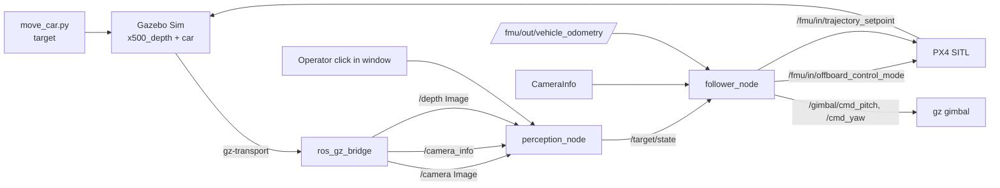
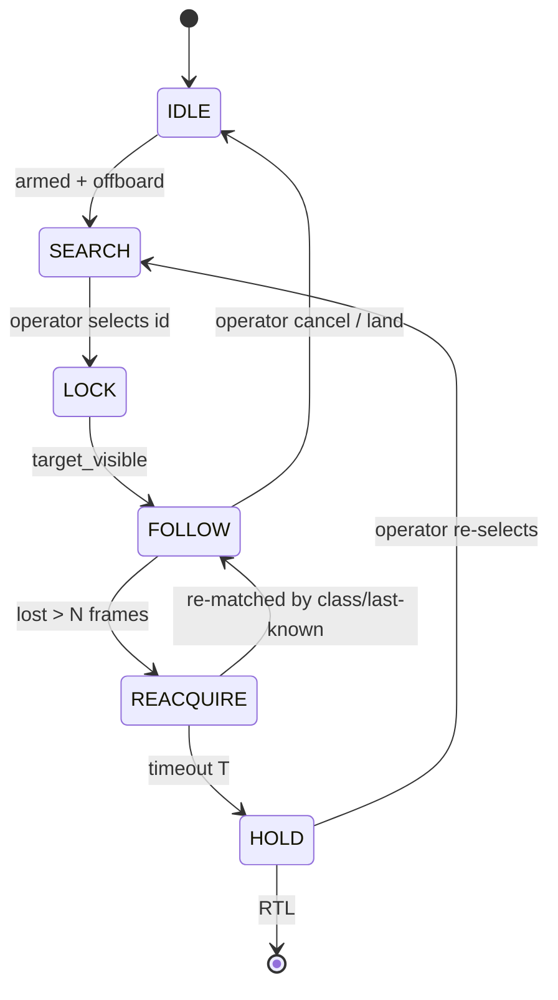

# Drone "Detect → Select → Follow" — System Design

**Base:** fork of `monemati/PX4-ROS2-Gazebo-YOLOv8` (PX4 SITL + Gazebo Garden/Harmonic + ROS 2 Humble + YOLOv8, `x500_depth` model with a 2-axis gimbal).

**Goal:** Operator selects a detected object (e.g. the circling car). The drone keeps it framed and follows it at a fixed standoff distance, recovering gracefully when the target is lost.

**Scope note:** This is *not* SLAM. It is detection + multi-object tracking + visual servoing. No map is built or required. SLAM would only re-enter if you later add obstacle-aware navigation while following.

---

## 1. What already exists vs. what you build

| Capability | In the repo today | Your work |
| --- | --- | --- |
| PX4 SITL + Gazebo + bridge | ✅ | — |
| RGB camera → ROS (`/camera`) | ✅ | — |
| Depth camera + `/camera_info` bridged | ❌ | **Add** |
| YOLOv8 detection | ✅ (`uav_camera_det.py`) | — |
| Multi-object **tracking** (persistent IDs) | ❌ | Trivial: `model.track(persist=True)` |
| Target **selection** (click-to-lock) | ❌ | **Build** |
| Pixel → 3D (deprojection w/ depth) | ❌ | **Build** |
| Following **controller** | ❌ | **Build** (new node) |
| Loss / re-acquire **state machine** | ❌ | **Build** |
| Offboard control path | ✅ (`px4_ros_com offboard_control`, and MAVSDK) | Replace with follower |
| Gimbal control | ✅ over gz-transport | Reuse, drive from follower |

The center of gravity of the effort is the right-hand column rows 4–8.

---

## 2. Architecture

Decouple perception from control. The **gimbal** keeps the target centered (fast inner loop, cheap, already hardware-present). The **body** maintains standoff distance and slowly yaws so the gimbal washes back toward center ("gimbal leads, body follows"). This isolates perception bugs from flight-control bugs and is far more robust than flying the whole airframe to center a bounding box.



ASCII fallback (node / topic graph):

```
 Gazebo ──► ros_gz_bridge ──► /camera ───────────┐
                            ├─► /camera_info ─────┤
                            └─► /depth (Image) ───┤
                                                  ▼
 operator click ───────────────────────►  perception_node
                                                  │  publishes
                                                  ▼
                                          /target/state  (TargetState.msg)
                                                  │
                /fmu/out/vehicle_odometry ──────► follower_node ──► /fmu/in/offboard_control_mode
                            /camera_info ───────►      │       ──► /fmu/in/trajectory_setpoint
                                                       └─────────► /gimbal/cmd_pitch, /gimbal/cmd_yaw
```

### Nodes

- **`perception_node`** (evolves `uav_camera_det.py`): subscribes `/camera`, runs YOLOv8 `.track()`, handles operator selection, deprojects the locked target with the depth image + intrinsics, estimates target velocity, publishes `TargetState`, and renders the annotated window.
- **`follower_node`** (new): subscribes `TargetState` + vehicle odometry, runs the state machine + PID control, streams offboard setpoints and gimbal commands. Owns all safety limits.

Splitting perception (Python/CV, GPU, variable latency) from control (fixed-rate, deterministic, safety-critical) is deliberate — never let YOLO's frame time dictate your offboard heartbeat.

---

## 3. Interfaces

### New bridge args (add to the existing `parameter_bridge`)

```bash
# camera_info (REQUIRED for deprojection)
/world/default/model/x500_depth_0/link/camera_link/sensor/IMX214/camera_info@sensor_msgs/msg/CameraInfo[gz.msgs.CameraInfo

# depth image (adjust sensor name to your x500_depth SDF)
/world/default/model/x500_depth_0/link/camera_link/sensor/StereoOV7251/depth_image@sensor_msgs/msg/Image[gz.msgs.Image

# gimbal commands ROS -> gz (so follower can publish over ROS)
/gimbal/cmd_pitch@std_msgs/msg/Float64]gz.msgs.Double
/gimbal/cmd_yaw@std_msgs/msg/Float64]gz.msgs.Double
```
> Verify exact gz topic names with `gz topic -l` after the sim is up — the depth sensor name in the `x500_depth` SDF varies by PX4 version.

### Custom message — `drone_follow_msgs/msg/TargetState.msg`

```
std_msgs/Header header
bool      target_visible       # true only if the LOCKED id is in this frame
int32     track_id             # -1 when none locked
float32   u                    # target center pixel x
float32   v                    # target center pixel y
float32   bbox_w
float32   bbox_h
float32   range_m              # depth at target center; NaN if unavailable
geometry_msgs/Point   position_cam     # 3D in camera optical frame; NaN if no depth
geometry_msgs/Vector3 velocity_world   # estimated target velocity (ENU); 0 until enough samples
```

---

## 4. Perception: track, select, deproject

**Tracking:** switch `.predict()` → `.track(persist=True, tracker="bytetrack.yaml")`. You now get a stable `id` per detection across frames.

**Selection (click-to-lock):** OpenCV `setMouseCallback` on the display window. On click, find the track whose bbox contains the point; store its `id` as `locked_id`. Keyboard fallback: `[`/`]` to cycle ids, `c` to clear.

**Deprojection (pixel → camera-frame 3D):** with intrinsics `K = [[fx,0,cx],[0,fy,cy],[0,0,1]]` and depth `Z` at `(u,v)`:
```
X = (u - cx) * Z / fx
Y = (v - cy) * Z / fy
position_cam = (X, Y, Z)
```
Sample depth as the **median over the central region of the bbox**, not a single pixel — single-pixel depth is noisy and frequently lands on a hole.

**Velocity estimate:** transform `position_cam` → world (ENU) using gimbal angles + vehicle pose, then run an alpha-beta or EMA filter on successive positions to get `velocity_world`. This feeds the controller's feed-forward term — without it, you chase a circling car with permanent lag.

Skeleton:

```python
# perception_node.py (skeleton)
import rclpy, cv2, numpy as np
from rclpy.node import Node
from sensor_msgs.msg import Image, CameraInfo
from cv_bridge import CvBridge
from ultralytics import YOLO
from drone_follow_msgs.msg import TargetState

class PerceptionNode(Node):
    def __init__(self):
        super().__init__("perception_node")
        self.bridge = CvBridge()
        self.model = YOLO("yolov8n.pt")
        self.locked_id = -1
        self.K = None
        self.depth = None
        self.last_pos = None
        self.create_subscription(Image, "/camera", self.on_rgb, 10)
        self.create_subscription(Image, "/depth", self.on_depth, 10)
        self.create_subscription(CameraInfo, "/camera_info", self.on_info, 10)
        self.pub = self.create_publisher(TargetState, "/target/state", 10)
        cv2.namedWindow("view"); cv2.setMouseCallback("view", self.on_click)
        self.tracks = {}  # id -> (xc, yc, w, h)

    def on_info(self, m): self.K = np.array(m.k).reshape(3, 3)
    def on_depth(self, m): self.depth = self.bridge.imgmsg_to_cv2(m, "passthrough")

    def on_click(self, ev, x, y, *_):
        if ev != cv2.EVENT_LBUTTONDOWN: return
        for tid, (xc, yc, w, h) in self.tracks.items():
            if abs(x-xc) < w/2 and abs(y-yc) < h/2:
                self.locked_id = tid; break

    def on_rgb(self, msg):
        frame = self.bridge.imgmsg_to_cv2(msg, "bgr8")
        res = self.model.track(frame, persist=True, tracker="bytetrack.yaml",
                               classes=[2], verbose=False)[0]   # 2 = car (COCO)
        self.tracks.clear()
        st = TargetState(); st.header = msg.header; st.track_id = self.locked_id
        st.target_visible = False
        if res.boxes.id is not None:
            for box, tid in zip(res.boxes.xywh.cpu().numpy(),
                                res.boxes.id.int().cpu().tolist()):
                xc, yc, w, h = box
                self.tracks[tid] = (xc, yc, w, h)
                if tid == self.locked_id:
                    st.target_visible = True
                    st.u, st.v, st.bbox_w, st.bbox_h = float(xc), float(yc), float(w), float(h)
                    self.fill_3d(st, int(xc), int(yc))
        self.pub.publish(st)
        # ... annotate + cv2.imshow("view", frame); cv2.waitKey(1)

    def fill_3d(self, st, u, v):
        if self.depth is None or self.K is None: 
            st.range_m = float("nan"); return
        patch = self.depth[max(0,v-3):v+4, max(0,u-3):u+4]
        Z = float(np.nanmedian(patch))
        st.range_m = Z
        fx, fy, cx, cy = self.K[0,0], self.K[1,1], self.K[0,2], self.K[1,2]
        st.position_cam.x = (u-cx)*Z/fx
        st.position_cam.y = (v-cy)*Z/fy
        st.position_cam.z = Z
        # velocity_world: transform to world, EMA finite-difference (omitted)
```

---

## 5. Control law

Image center `(cx, cy)`; locked target pixel `(u, v)`; range `Z`; desired standoff `d*`.

**Gimbal inner loop (~30 Hz, follows camera frame rate):**
```
e_pitch = (v - cy) / H            # normalized vertical error
e_yaw   = (u - cx) / W            # normalized horizontal error
pitch_cmd = clamp(PID_gp(e_pitch), -90deg, +30deg)
yaw_cmd   = clamp(PID_gy(e_yaw),   -90deg, +90deg)
```
Gimbal absorbs fast target motion so the camera never loses the object during body maneuvers.

**Body outer loop (~20 Hz, fixed rate, independent of CV latency):**
```
# forward: regulate standoff distance using depth
e_d   = Z - d*
vx_b  = clamp( PID_d(e_d) + ff_range_rate , -v_max, v_max )

# heading: yaw the body to wash gimbal_yaw back toward 0 (point body at target)
yaw_rate = clamp( K_yaw * gimbal_yaw_angle , -wr_max, wr_max )

# lateral: small correction from residual horizontal error after gimbal
vy_b  = clamp( PID_lat(e_yaw) , -v_max/2, v_max/2 )

# altitude: hold; let gimbal pitch handle vertical framing
vz_b  = PID_alt(alt - alt_hold)

setpoint = body_velocity(vx_b, vy_b, vz_b, yaw_rate) + velocity_world_ff
```

**Feed-forward (`velocity_world_ff`)** from the target velocity estimate is what lets you track the circling car without spiraling outward. Pure P-control on a curved trajectory always lags; the circle is a good stress test, by design.

**Hard limits (in `follower_node`, non-negotiable):** `v_max`, `wr_max`, accel slew rate, altitude floor/ceiling, geofence radius, min/max standoff. And the offboard heartbeat: publish `OffboardControlMode` + `TrajectorySetpoint` at ≥ ~20 Hz **always**, even in SEARCH/LOST, or PX4 kicks you out of offboard.

---

## 6. State machine



- **SEARCH:** hold position, slow gimbal/body yaw sweep, run detection, wait for selection.
- **LOCK / FOLLOW:** the control law above; keep streaming setpoints.
- **REACQUIRE:** target lost or ID switched. Hold position, point gimbal at last-known world bearing, re-detect the target *class* near the last-known location and re-lock. (This is why ID-lock alone fails — ByteTrack reassigns IDs after occlusion.)
- **HOLD / RTL:** re-acquire timed out. Hover at safe altitude or return-to-launch. Operator can re-select.

`follower_node` skeleton:

```python
# follower_node.py (skeleton)
import rclpy
from rclpy.node import Node
from px4_msgs.msg import OffboardControlMode, TrajectorySetpoint, VehicleOdometry
from std_msgs.msg import Float64
from drone_follow_msgs.msg import TargetState

class Follower(Node):
    def __init__(self):
        super().__init__("follower_node")
        self.state = "SEARCH"; self.lost = 0; self.tgt = None
        self.d_star = 8.0; self.alt_hold = 6.0
        self.create_subscription(TargetState, "/target/state", self.on_target, 10)
        self.create_subscription(VehicleOdometry, "/fmu/out/vehicle_odometry", self.on_odom, 10)
        self.ocm = self.create_publisher(OffboardControlMode, "/fmu/in/offboard_control_mode", 10)
        self.sp  = self.create_publisher(TrajectorySetpoint, "/fmu/in/trajectory_setpoint", 10)
        self.gp  = self.create_publisher(Float64, "/gimbal/cmd_pitch", 10)
        self.gy  = self.create_publisher(Float64, "/gimbal/cmd_yaw", 10)
        self.create_timer(0.05, self.loop)        # 20 Hz, ALWAYS runs

    def on_target(self, m):
        self.tgt = m
        self.lost = 0 if m.target_visible else self.lost + 1

    def loop(self):
        self.publish_offboard_mode()              # heartbeat first, every tick
        self.step_state_machine()                 # transitions
        sp = self.compute_setpoint()              # control law -> body velocity
        self.sp.publish(sp)
        self.drive_gimbal()
```

---

## 7. Milestones (each independently testable)

0. **Baseline.** Reproduce the repo running (Docker image is published). Confirm detection on the circling car and the gimbal keys work.
1. **Track.** `.predict()` → `.track()`. Overlay persistent IDs. Confirm the car keeps one ID per loop. *Exit:* stable ID across a full circle.
2. **Select.** Click-to-lock; publish image-only `TargetState`. *Exit:* clicking the car locks it; topic shows correct `u,v`.
3. **3D.** Bridge `/camera_info` + depth; deproject; fill `range_m` + `position_cam`. *Exit:* `range_m` matches the real sim distance within ~10%.
4. **Gimbal-only servo.** Follower drives *only* the gimbal to center the target; body does not move. Safest possible perception→actuation loop. *Exit:* gimbal holds the car centered as it circles.
5. **Body follow.** Add forward (standoff) + yaw-to-face. Fixed altitude. Tune PID. *Exit:* drone holds ~d* behind/over the car for a full loop.
6. **Feed-forward + state machine.** Add target-velocity FF and loss/REACQUIRE handling + safety limits. *Exit:* survives an occlusion and re-locks; lag visibly reduced.
7. **(Optional) robustness.** Harder car path, multiple cars, class re-acquisition, standoff geometry options.

---

## 8. The one fork worth your input

**Following geometry.** Pick before tuning, because it changes the control mapping:
- **Chase (behind/above at distance d\*)** — body yaws to face the target, moves forward to standoff. Simplest; recommended default.
- **Top-down orbit (fixed altitude directly above, gimbal straight down)** — trivial framing, but standoff becomes altitude and you lose forward-velocity intuition.
- **Standoff orbit (circle the target at radius r)** — looks great, hardest control (adds a tangential velocity component and constant lateral setpoint).

Default to **chase** unless you have a reason. Don't build all three.

---

## 9. Honest risks

- **Gimbal over gz-transport, not ROS** — bridging `/gimbal/cmd_*` is fiddly; verify with `gz topic -l` / `gz topic -e`.
- **Depth/RGB extrinsics** — if the depth sensor and RGB are different frames on `x500_depth`, deprojected points won't align with the RGB bbox. Check the SDF; use a registered depth or apply the transform.
- **NED/ENU/body sign bugs** — PX4 is NED, ROS is ENU. This is the same class of frame bug you fight on lexxmoma; expect to lose time here.
- **ID switching** — ByteTrack reassigns IDs after occlusion; ID-lock alone is insufficient (hence REACQUIRE).
- **Sim car detectability** — COCO-pretrained YOLOv8 should detect the Gazebo hatchback as "car," but confirm confidence in Milestone 1 before building on it; if weak, fine-tune on a few sim frames.
- **CV latency vs control rate** — never gate the offboard loop on YOLO frame time; the split-node design exists to prevent exactly this.
